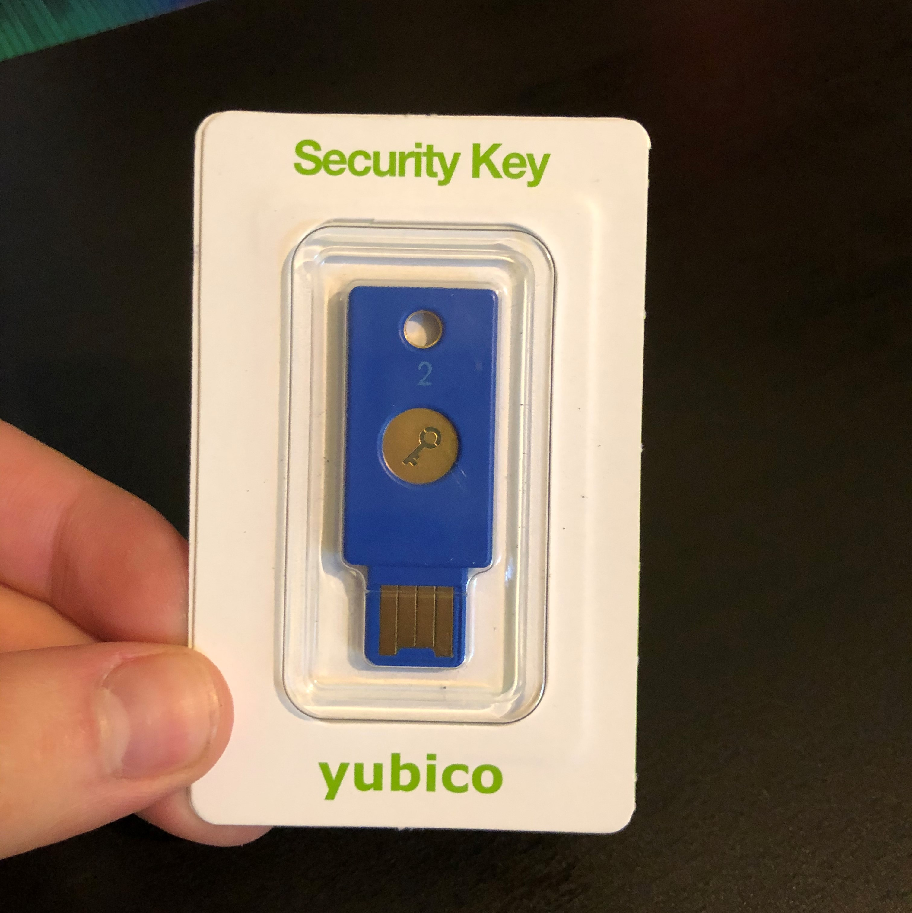
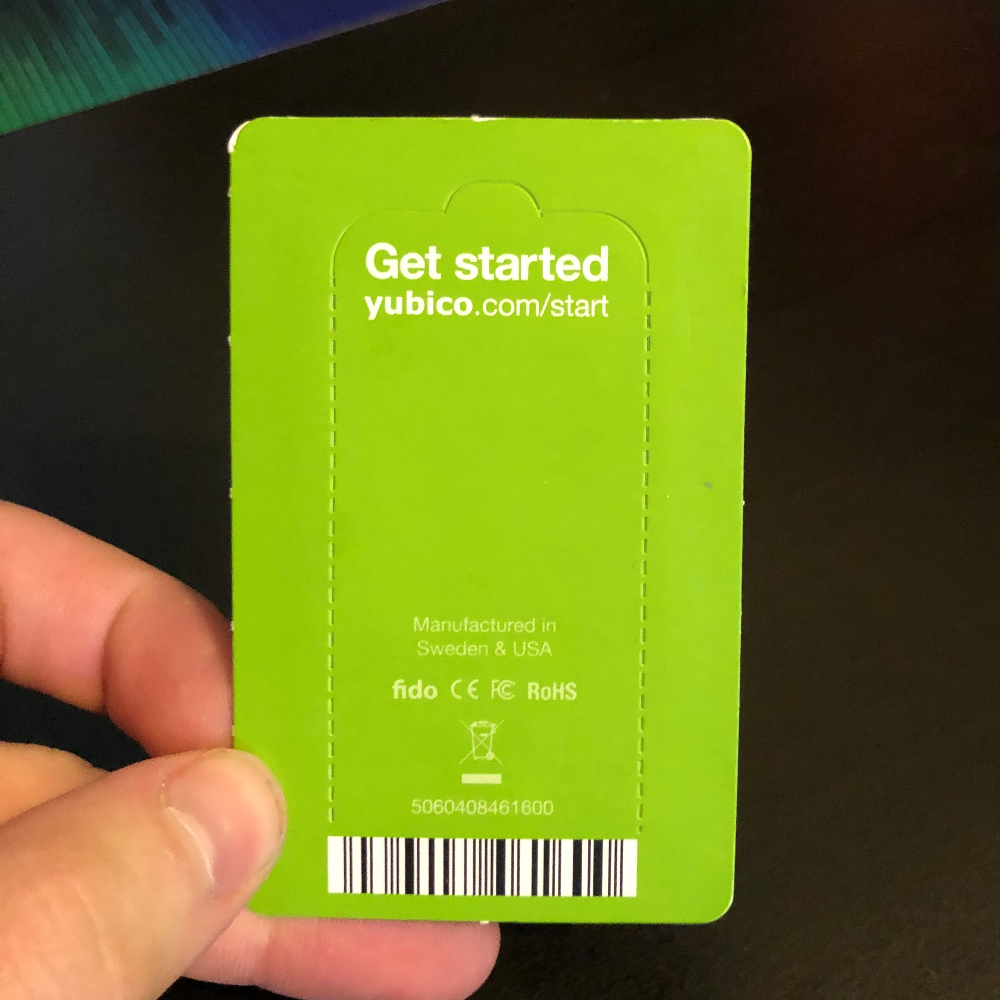
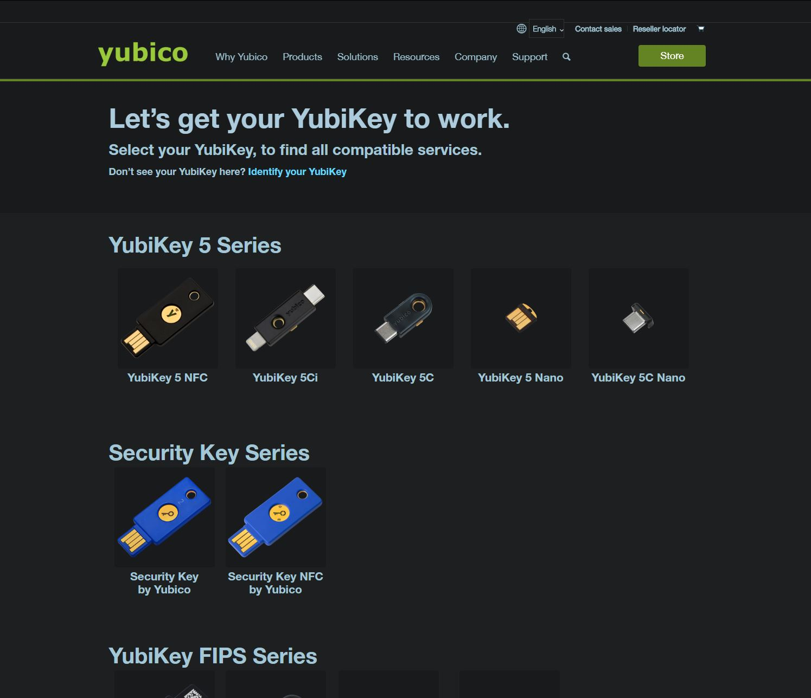
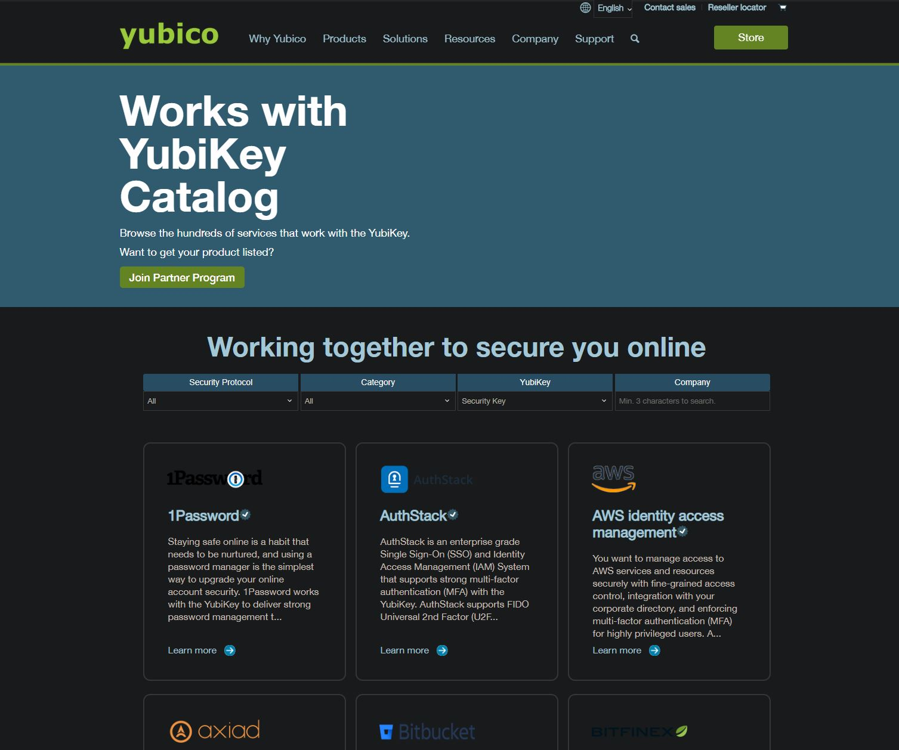

# Setting Up Yubico Authentication Key - Yubikey
by Cody DeLozier on February 23nd, 2020

My initial goal before reading anything on the Yubikey was to set it up to better protect my Google account specifically.
For those unaware, multifactor authentication (MFA) is a secure way to protect your online accounts such as Dropbox, personal bank login etc.
Yubico created a unique MFA method that requires the user to enter their password followed by tapping the physical key against their phone 
(for mobile users) or tapping the physical key with their finger for desktop/laptop users to login.

I started out by removing the key from the packaging and navigating to https://www.yubico.com/start as seen on the back of the packaging.

After navigating to the site, I was prompted to select my Yubikey (see below):

After selecting my key, displayed was a list of the services that support this key.

I was able to quickly search for Google Inc. and was then sent to Google's help page to enable 2-Step Verification (or MFA).
I selected the text tutorial instead of the video tutorial and followed the on-screen instructions. I entered my password, inserted the key 
into my computer, tapped the key and the setup was complete! All in all, the user experience for this setup was **efficient** and **satisfying**.
This experience was efficient in that it did not contain unnecessary information to complete the setup and was straight to the point. I was able to accomplish my
goal in less than 10 minutes. This experience was also satisfying due to the well-organized layout and the on-screen feedback received after tapping the Yubikey. 
The only noticeable weakness was that it was not clear whether my key supported mobile login (NFC) or not. Through further research outside of the tutorial, 
I was able to determine my Yubikey would not work for mobile login due to a lack fo NFC functionality (Near Field Communication). This could easily be addressed/fixed by adding a simple icon of the supported devices next 
to each key (laptop, desktop, smartphone etc.) One major strength was the provided option to select either a video tutorial or text tutorial depending on personal preference.
