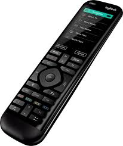
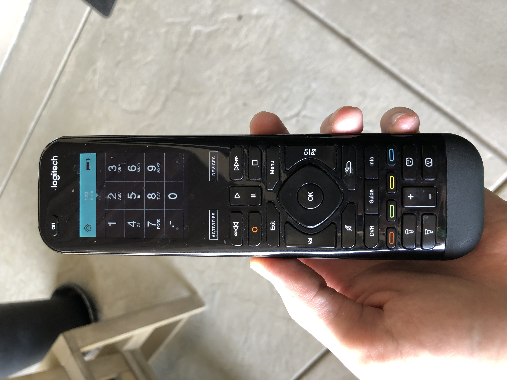

# Using the Logitech Harmony Elite Remote
by Cody DeLozier on May 9th, 2020

   This weekend I was able to test out my parents’ new smart tv and sound system. I was surprised to discover they had decided to go with a universal smart remote, rather than using the remote provided with the TV. My original goal in this overall interaction was to use and understand the basic functions of this remote. At a first glance, there is a lot going on with this remote not typical in a standard smart TV remote. Starting from the top left-hand corner of the remote there is the standard “off” button as expected that powers off the entire system. Just below the off button there is a small touch screen that provides the user with several options. I discovered if you pick up the remote, the screen will turn on automatically for you displaying the following options: Watch TV, Netflix, Watch a Movie and Sonos (music software). You can select any of these options and they will open the specified command on the TV. I used Netflix as my choice and discovered the TV turned on and launched Netflix as I had hoped. 

  After closing out Netflix and proceeding to explore more of the available options of the remote, I discovered there are three pages in which you can swipe left and right from on the touch screen. I found it useful that the page name is displayed at the top of the screen. The first page (Activities) contains the simple open application commands listed above. The second page contains Home, Smart Hub and Tools (the other options were not listed as they will rarely be used). I discovered the options on the second page are based on what is selected on the Activities page (Netflix, Watch Tv etc.). The third page of the touch screen contains the standard numpad to enter letters/numbers for channels if needed. I found it extremely difficult to swipe between pages on the tiny little screen making it easy to accidentally click other buttons in the process. A settings icon providing basic settings of the remote is located in the top left corner of the touch screen. A battery icon is also displayed in the top right corner of remote displaying the current battery life. In the process of familiarizing myself with the touch screen I continuously opened a menu with a blank screen and a hand indicating a gesture of some sort. Through the testing of this remote I was unable to learn the direct cause of opening this page or what gestures could be used for commands.

   Below the touch screen are two touch sensitive “Activities” and “Devices” buttons. The Activities button takes you to the Activities page as expected and the Devices button pulls up a menu containing all available devices connected to your smart TV. I was satisfied to discover these buttons provide **feedback** when pushed in the form of vibration.

  When attempting to navigate through Netflix, Direct TV and Hulu I found myself only using a few of the buttons on the remote (OK, Volume, Ch|Pg, Menu, Back and Exit). Most of these buttons are very straight forward and can be found on almost any TV remote. That being said, there are over 10 buttons on this remote that I did not need to use or required me reading the manual in order to learn. 

   All in all, using the remote was an entirely new experience for me and required quite a bit of use to feel somewhat comfortable with it. I found the user experience for this remote to be **usable** and **learnable** in that with enough time, the basic functions of the remote can be learned and used for the most part as intended. This user experience was by no means **satisfying** in that it is extremely easy to unintentionally trigger applications to open or cause other commands to run with the sensitive touch screen that turns on automatically due to movement. I found that most of the options on the touch screen could have easily been implemented using standard/programmable buttons to provide a much more **error tolerant** and **effective experience**. I can confidently say that I accomplished my goal in learning this remote although it was not as smooth as I had expected it would be. 
